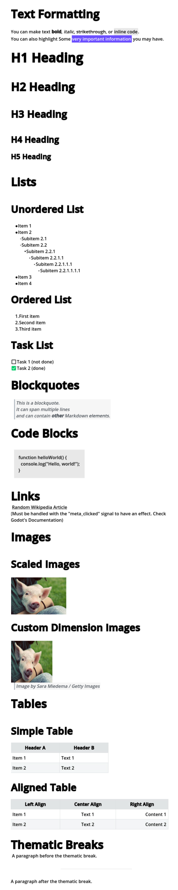

# About 
If someone is interested in this and need some help or explanation, just ask and I will try to answer or write a better documentation. For now, if you just want to try this out just drop the `markdown_parser` inside your `modules` folder at Godot's source code and build the binaries (just a `scons -j4` will be enough. If in doubt just follow Godot's documentation on this, it's very detailed). With the new binary you can run the demo project and see the module in action. Basically the module uses `cmark-gfm` to to convert markdown extendend syntax into bbcode, so Godot can understand and use everything the actual nodes already have

## Demo Project

